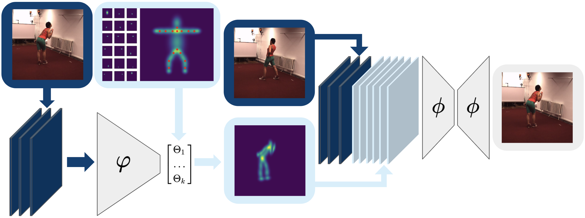

# UPDATE
I uploaded code and checkpoint for the pretrained model (trained on the Human 3.6m dataset).
Formatting of the input and usage is provided comments found in src/core/pretrained_model.


# Unsupervised Human Pose Estimation through Transforming Shape Templates (CVPR2021)

<br>
<br>
[project page](infamtmotion.github.io)


# Dependencies
Code was run with the following dependencies:
```
json-tricks==3.15.5
kornia==0.5.2
natsort==7.1.0
numpy==1.19.5
opencv-python==4.5.1.48
PyYAML==5.4.1
scipy==1.6.0
tensorboard==2.4.1
torch==1.8.1
torchvision==0.9.1
```
Run ```pip install -r requirements.txt``` to install packages.

# Usage
Since we cannot provide the datasets, you have to implement your own ```Dataset``` class in ```src/core/utils/dataset``` which should return two rgb images with shape ```[3, height, width]``` containing the same person and background, but in different poses.
<br>
## Template and anchor points
Template and anchor points are saved and loaded as json files. <br>
<br>
```template.json``` is a dict of length ```num_parts``` which specifies the location and size/shape and angle of the body parts represented by 2d gaussians (x: columns, y:rows). <br>
<br>
```anchor_points.json``` is also a dict of the same length specifying anchor points for each body part (x: rows, y:columns).
Check the two provided json files for details. <br>
The order of body parts should be the same in both files.
<br>
## Train
If you use your own template and anchor points, make sure to change ```src/core/utils/helper/load_anchor_points``` and ```src/core/utils/losses/compute_anchor_loss``` according to your defintions.
For training, adjust the config file in ```configs``` as well as ```train.py``` with the paths to your data and run ```python train.py --config path/to/your_config_file```

## Inference
We'll provide checkpoints and inference code for the model trained on human36m and our infant dataset soon, stay tuned for that.

# Cite
If you find this code useful for your own project/paper, please cite our work:
<br>
```
@inproceedings{LSchmidtke2021,
  author = {Luca Schmidtke, Athanasios Vlontzos, Simon Ellershaw, Anna Lukens, Tomoki Arichi, and Bernhard Kainz},
  title = {Unsupervised Human Pose Estimation through Transforming Shape Templates},
  booktitle = {Proc. IEEE Conf. on Computer Vision and Pattern Recognition (CVPR)},
  year = {2021},
}
```
